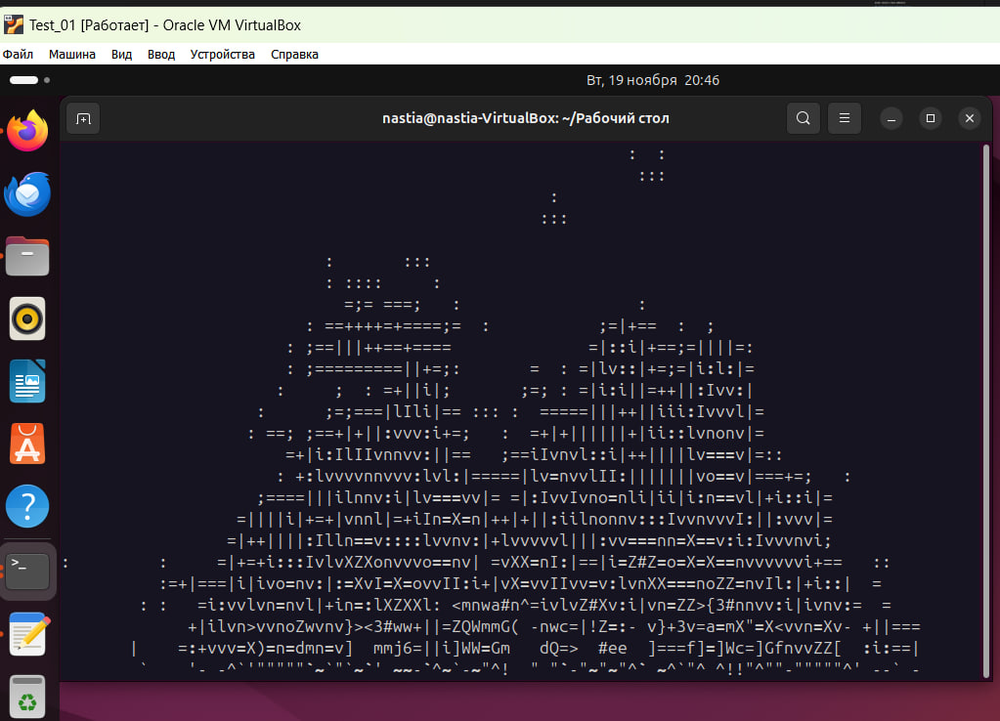

# Панас Анастасия Андреевна, группа K3162, номер ИСУ 467006
1) Перед выполнением лабораторной работы номер 4 я установила Docker

2) Далее мне было необходимо написать Dockerfile, для этого я создала пустой текстовый документ с соответствующим названием для собственного удобства, в  нем я прописала следующие строчки кода

Рассмотрим, за что отвечают строки кода в моем файле

- Указываю, на основе какого образа будет работать мой

>FROM ubuntu:24.10

- Указываю, что хочу запустить (обновляю ПО aafire и устанавливаю утилиту ping)

>RUN apt-get update && apt-get install -y libaa-bin iputils-ping

- Определяю аргумент сборки

>ENV FIRE="false"

- Прописываю условие запуска

>CMD ["aafire"]

3) После я сохранила файл и закрыла его, а в терминале запустила команду для сборки образа

>docker build -t aafire .

4) Далее я создала сеть при помощи команды

>docker network create myNetwork

5) Затем в первом терминале я создала и запустила первый контейнер 

>docker run -it --name container_first --network myNetwork aafire:latest 

6) Затем проделала все то же самое во втором терминале для второго контейнера

>docker run -it --name container_second --network myNetwork aafire:latest

А в третьем терминале запустила команду ping, чтобы протестировать соединение между контейнерами
>docker exec -it container_first ping container_second

7) Проверила запущенные контейнеры

>docker ps

8) Остановила работу контейнеров 

>docker stop container_first

>docker stop container_second

